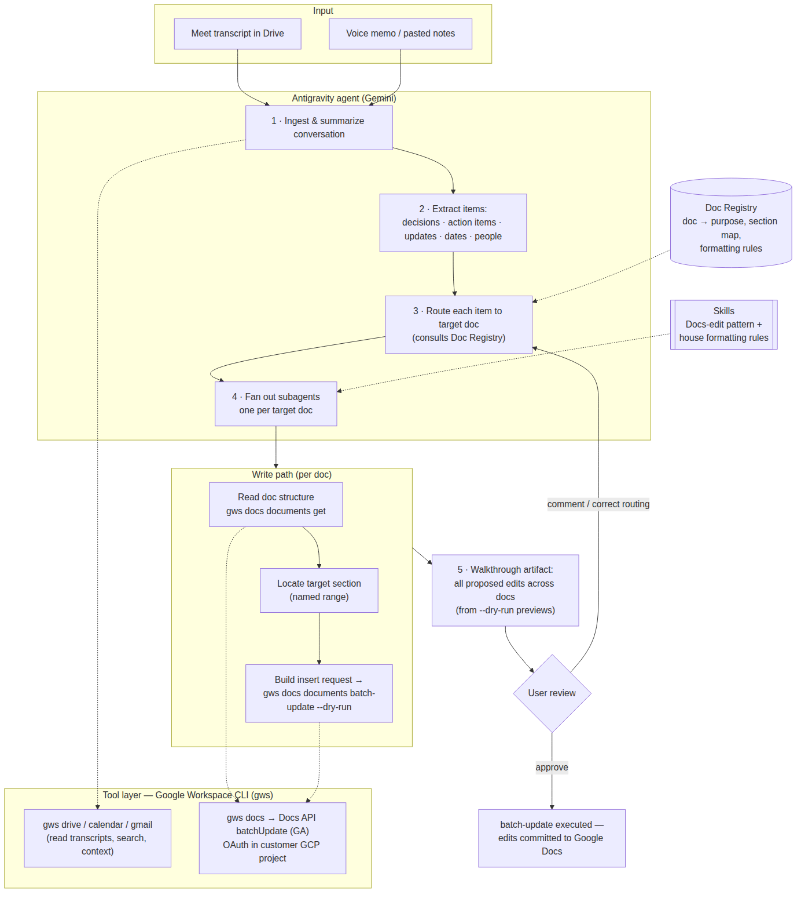

# Virtual AI Chief of Staff on Google Antigravity

**Technical overview**

Assumes a Google Cloud environment: the customer is a Google Workspace organization with a GCP project available. All OAuth clients, API enablement, and agent inference run under that project.

## Problem Statement

A single conversation (a meeting, a voice memo, a braindump) often contains information that belongs in several different Google Docs: project notes, 1:1 docs, decision logs, task trackers. Distributing that information is currently a manual step. The goal is an agent that takes one conversation as input, determines which docs are affected, and updates each one in the appropriate section and format, with the user reviewing changes before they are written.

## Feasibility Summary (verified)

The primary tool layer is the **Google Workspace CLI (`gws`)** — Google's first-party CLI covering the full Workspace API surface, including Docs editing:

| Capability needed | Status | How |
|---|---|---|
| Agent orchestration, subagents, scheduled tasks, skills | Available | Antigravity desktop app / CLI (`agy`) |
| Read conversation transcripts / files from Drive | Available | `gws drive files ...` (read, search, download) |
| Calendar / Gmail context | Available | `gws calendar ...`, `gws gmail ...` |
| **Edit Google Docs in place** | Available | `gws docs documents batch-update` → Docs API `batchUpdate` (GA): positional inserts, named ranges, paragraph/text styling |

`gws` authenticates via OAuth against the customer's own GCP project (`gws auth setup` / `gws auth login`), returns structured JSON, and supports `--dry-run` to preview requests — a natural review-before-write primitive. Workspace admin controls and user permissions apply as usual.

## Architecture

## Design Notes

1. **Doc registry.** A lightweight index (a control doc or Drive manifest) mapping each doc to its purpose ("1:1 with Sarah", "Project Phoenix decision log"), its section layout, and formatting conventions. The routing step consults this to decide where each extracted item belongs. This is the core of the system; extraction and writing are comparatively straightforward. Using Docs API *named ranges* in each target doc makes section targeting deterministic rather than heuristic.

2. **Docs-edit skill over `gws`.** Raw `batchUpdate` request JSON is verbose and easy to get wrong, so the edit pattern is encoded once as an Antigravity skill: `gws docs documents get` to read structure → locate the named range for the target section → construct the `batchUpdate` insert request → run with `--dry-run` for the review artifact → execute on approval. The skill enforces the house rules: append dated entries only, never delete existing content.

3. **Formatting skills.** Conventions encoded once as Antigravity skills — action items become checkboxes with owner and date, decisions get dated entries — so behavior is consistent across runs.

4. **Subagents for multi-doc fan-out.** A conversation typically touches 3–6 docs. Each target doc gets its own updater subagent running in parallel; results are reviewed together.

5. **Review before write.** The agent's walkthrough artifact presents all proposed edits across docs as one change-set (built from the `--dry-run` previews). Nothing is written until approved; corrections to routing feed back into the registry.

6. **Optional automation.** An Antigravity scheduled task can sweep new Meet transcripts in Drive on a cadence (`gws drive files list` filtered by folder and time) and process them without manual input, once edit quality is established.

## Suggested Timelines

| Phase | Timeline | Scope |
|---|---|---|
| 1 — Prototype | Week 1 | Antigravity CLI + `gws` (auth setup in the GCP project); paste one conversation manually; 2–3 target docs with named ranges; Docs-edit skill with `--dry-run` review-before-write. Validates routing accuracy and in-place edit quality. |
| 2 — Pilot | Weeks 2–3 | Doc registry, formatting skills, subagent fan-out, automatic Meet transcript ingestion from Drive. Daily use with review gate on. |
| 3 — Hardened | Weeks 4–6 | Scheduled tasks, edit audit trail (doc revision history + agent logs), Workspace admin review of OAuth scopes, pin the `gws` version. Optionally narrow the write surface to a purpose-built tool (custom MCP server or Cloud Run service wrapping `batchUpdate` with only `insert_entry`/`list_sections`), and repackage via the Antigravity SDK. |

## References

- [Google Workspace CLI (`gws`) — googleworkspace/cli](https://github.com/googleworkspace/cli)
- [InfoQ: Google Workspace CLI overview](https://www.infoq.com/news/2026/06/google-workspace-cli/)
- [Google Docs API — batchUpdate](https://developers.google.com/workspace/docs/api/reference/rest/v1/documents/batchUpdate)
- [Google Antigravity documentation](https://antigravity.google/docs/home)
- [Configure the Google Workspace MCP servers (alternative tool layer)](https://developers.google.com/workspace/guides/configure-mcp-servers)
- [Configuring MCP servers and skills for Antigravity](https://medium.com/google-cloud/configuring-mcp-servers-and-skills-for-antigravity-cli-and-ide-a938c7eebb78)
